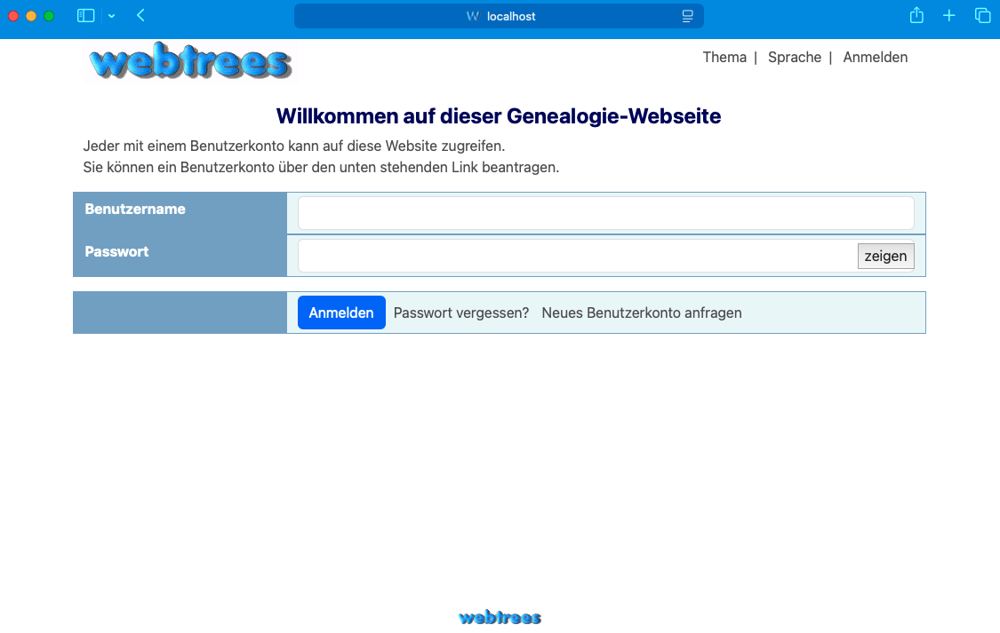

# genTree

This is my implementation of a containerize solution running [webtrees](https://webtrees.net) and mysql in two containers.

create an .env file in the same folder as the compose file and provide the variables

to access use the app base_url:ports

when starting the container the first time, the initial setup is running the values specified in the environment :-)

